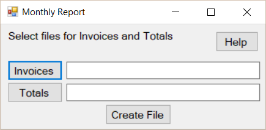
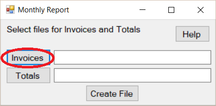
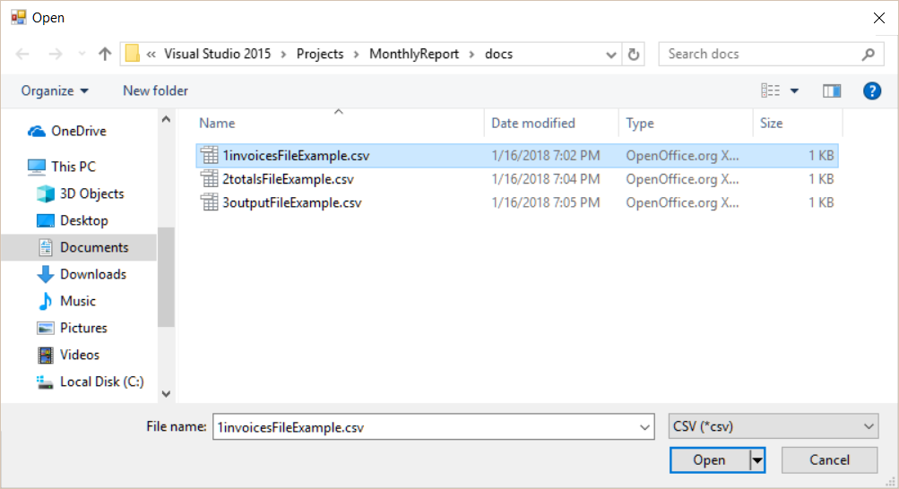
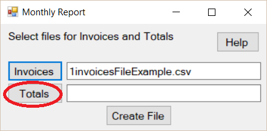
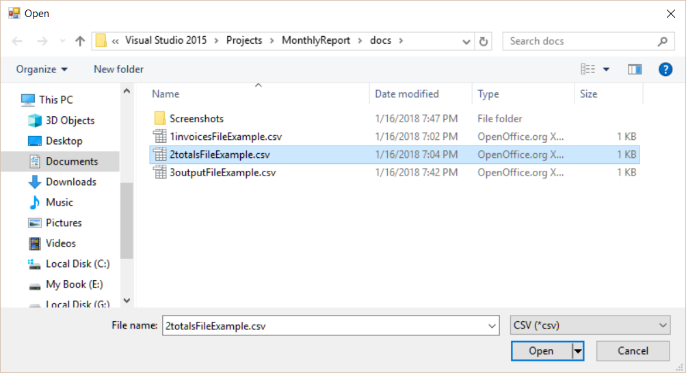
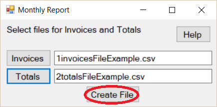
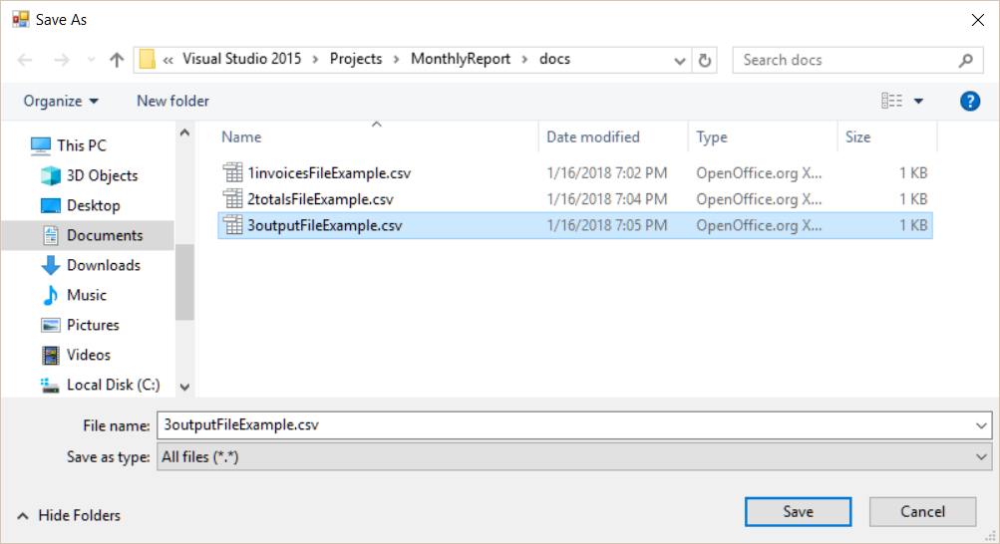
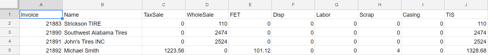

# MonthlyReport

The Purpose of this project is to generate a Monthly Sales Report using data from QuickBooks Pro. 

I'm creating this program for a local small business (Owned by my parents, so I'm doing the work for free and making the project files public). The Monthly Sales Report was previously created by hand.

The goal of this project is to speed up the creation of the Monthly Sales Report.

## **Start the program**

## **Press the Invoices Button**

## **Select the Invoice File**

## **Press the Totals Button**

## **Select the Totals File**

## **Press the Create File button**

## **Select the location to save the file**

## **The Output File should look something like this**

